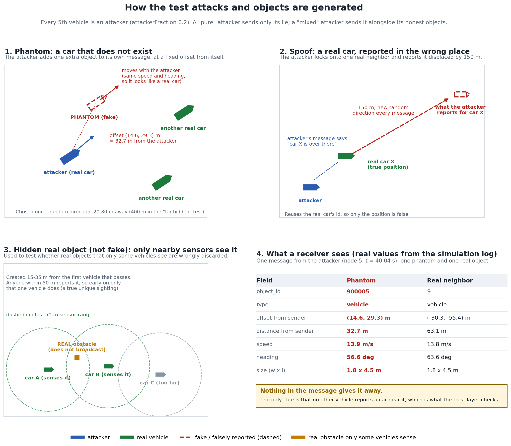

# veins_ros_v2v_ucla

V2V **Sensor Data Sharing (SDSM)** dissemination benchmark on a **UCLA-area SUMO network**, using **Veins** (OMNeT++ + SUMO) with optional ROS 2 bridge. The stack uses **full IEEE 802.11p PHY/MAC** (path loss, fading, interference, CSMA/CA) instead of toy drop/delay models.

**Canonical paper comparison (v2):** `Periodic`, `Greedy_v2`, and `HybridSDSM_v2` at **~400 vehicles**, **300 s**, **seed 0** (effective `num_vehicles` in `*-metadata.csv` may be slightly below the requested `-n` due to SUMO insertion dynamics). See `CLAUDE.md` for the latest headline numbers and `REWRITE_SUMMARY.md` for design provenance.

---

## Simulation stack

| Component | Role |
|-----------|------|
| **[SUMO](https://eclipse.dev/sumo/)** | Traffic: car-following, lanes, signals on the UCLA-area net. |
| **[OMNeT++](https://omnetpp.org/)** | Discrete-event core, modules, `.ini` / `.ned`. |
| **[Veins](https://veins.car2x.org/)** | TraCI bridge, `Mac1609_4`, `Decider80211p`, mobility. |
| **ROS 2** (optional) | UDP bridge for live TX/RX; not needed for batch CSV runs. |

Each **TraCI step (0.1 s)** SUMO advances vehicles; Veins syncs OMNeT++ `Car` modules. **`RosSDSMApp`** decides when to send and which objects to pack, then the MAC/PHY delivers or drops packets. Successful receptions are logged to CSV under `results/` (see `.gitignore`: raw `simulations/results/` is local scratch).

---

## Simulation world (current defaults)

| Aspect | Setting |
|--------|---------|
| Playground | **1300 m × 1000 m** (`simulations/omnetpp.ini`) |
| Channel | **`config.xml`:** `SimplePathlossModel` **α = 2.75**, **Nakagami** **m = 1.5** (constM); **5.89 GHz** decider |
| TX power | **100 mW (20 dBm)** |
| Noise / sensitivity | **−98 dBm** noise floor, **−110 dBm** min power (typical Veins 802.11p) |
| Interference range | **`maxInterfDist = 1500 m`** (avoids clipping far interferers) |
| Obstacle shadowing | **Off** (no building polygons); metadata records `obstacle_shadowing,false` |
| Fleet size | Set via `run_experiments.py --num-vehicles N`; **metadata `num_vehicles`** is the **effective** count for that run |

---

## Implementation parameters (reference)

**Authoritative definitions:** `simulations/apps/RosSDSMApp.ned` (all `appl.*` defaults), `simulations/omnetpp.ini` (world + PHY + per-`[Config]` overrides), `simulations/config.xml` (analogue models), `sumo/scenario.sumo.cfg` (SUMO horizon / step).

### Experiment runner (`run_experiments.py`)

| Symbol / flag | Typical value | Notes |
|---------------|---------------|--------|
| `SIM_DURATION_S` | **300** | Default wall-clock sim horizon unless overridden |
| `DEFAULT_NUM_VEHICLES` | **400** | Canonical density; routes regenerated via `sumo/gen_ucla_routes.py` → `sumo/routes.rou.xml` |
| `--seed` / `runnumber` | e.g. **0** | Drives `*.node[*].appl.runNumber = ${runnumber}` and reproducibility |
| `SEEDS` | `0..9` | Full multi-seed sweep when you run without narrowing `--seed` |

### SUMO (`sumo/scenario.sumo.cfg`)

| Parameter | Value |
|-----------|--------|
| `begin` | 0 |
| `end` | **300** (s) |
| `step-length` | **0.1** (s) |

### OMNeT++ network & TraCI (`simulations/omnetpp.ini` `[General]`)

| Parameter | Value |
|-----------|--------|
| `network` | `networks.TwoCarsScenario` |
| `sim-time-limit` | **300 s** |
| `seed-set` | `${runnumber}` |
| `repeat` | **1** |
| `*.manager.updateInterval` | **0.1 s** |
| `*.world.playgroundSize{X,Y,Z}` | **1300 m**, **1000 m**, **50 m** |
| `*.connectionManager.maxInterfDist` | **1500 m** |
| `*.node[*].nic.phy80211p.noiseFloor` | **−98 dBm** |
| `*.node[*].nic.phy80211p.minPowerLevel` | **−110 dBm** |
| `*.node[*].nic.mac1609_4.txPower` | **100 mW** |

### PHY analogue models (`simulations/config.xml`)

| Model | Parameters |
|-------|------------|
| `SimplePathlossModel` | **α = 2.75**, thresholding on |
| `NakagamiFading` | **m = 1.5**, `constM = true` |
| `Decider80211p` | **5.89 GHz** center frequency |

### `RosSDSMApp` — mode switches (NED defaults; override in `omnetpp.ini`)

| Parameter | Default | Role |
|-----------|---------|------|
| `sendInterval` | **1 s** | Base interval; **[Config Periodic]** sets **0.1 s** |
| `periodicEnabled` | true | Periodic path vs greedy-driven |
| `greedyEnabled` | false | v1 weighted-sum greedy |
| `hybridEnabled` | false | v1 / v2 hybrid |
| `hybridVariant` | `"v1"` | **`"v2"`** for HybridSDSM_v2 |
| `greedyVariant` | `"v1"` | **`"v2"`** for Greedy_v2 (shared scheduler with Hybrid v2) |
| `bsmImpliedMode` | false | Header-only / zero-object ablation |
| `useVoiObjectSelection` | false | Legacy VoI object ranking (v1 hybrid path) |
| `rosBridgeMode` | `"off"` | **`"off"`** / `"log"` / `"live"` |

### `trust_sdsm_v2` — imperfection injection (NED defaults; all off unless set)

Used by the `trust_*` configs in `simulations/omnetpp_trust.ini`. With every value at its default the data is the original clean ground truth.

| Parameter | Default | Role |
|-----------|---------|------|
| `positionNoiseStdDev` | **0 m** | Gaussian jitter (σ) on each reported object position; applied to the serialized report only, never the stored ground truth |
| `attackerFraction` | **0.0** | Fraction of vehicles that lie; deterministic (`nodeIndex % round(1/fraction) == 0`) |
| `attackType` | `"phantom"` | **`"phantom"`** fabricates an extra object (id `900000+nodeIndex`) at a fixed offset; **`"spoof"`** teleports one locked-on real neighbor by `spoofJumpDistance` |
| `spoofJumpDistance` | **150 m** | Teleport distance for `attackType="spoof"` |
| `attackerPureMode` | false | Attacker sends **only** its lie (no honest objects), so mixed-in honest traffic cannot inflate its reputation |
| `phantomOffsetDistance` | **0 m** | >0: fixed distance of the phantom from its sender (default: random 20-80 m); large values hide it from other vehicles |
| `hiddenObjects` | **0** | Number of real, static, **non-broadcasting** obstacles (think parked vehicles, pedestrians) only sensed by vehicles within `sensorRange`. Vehicles with `nodeIndex % hiddenHostPeriod == 0` each create one near where they first send |
| `hiddenHostPeriod` / `sensorRange` | **2** / **50 m** | Which vehicles create a hidden object / how close a vehicle must be to sense it |

### `trust_sdsm_v2` — engine constants (`sdsm_trust_perception`)

| Constant | Value | Role |
|----------|-------|------|
| `REPUTATION_DEFAULT` | **0.5** | Starting reputation for every sender; decay baseline |
| `DELTA` | **0.10** | Max reputation change per frame: `R_new = R_old + DELTA·S_frame`, `S_frame = (C−I)/N_total` |
| `DECAY_RATE` | **0.003** | Drift toward baseline per frame with nothing to score |
| `TAU_MIN` / `TAU_MAX` / `GAMMA` | **0.30** / **0.90** / **2.0** | Dynamic gate: `τ(R) = 0.90 − 0.60·R²` |
| `HIGH_TRUST` | **0.95** | At/above this, all of a sender's objects are admitted; below, only corroborated ones |
| `SUPPORT_THRESHOLD_THETA` | **1.0** | Reputation mass needed to corroborate a report |
| `T_DEADLINE_S` | **15 s** | Grace window before an uncorroborated report is back-charged |
| `flush_interval_s` | **0.5 s** | Verdict bucket width (launch parameter) |
| `OPPORTUNITY_RANGE_M` / `NEAR_REPORT_M` | **150 m** / **10 m** | Probabilistic admission: who could have witnessed an object / what counts as having reported it |
| `P_ADMIT` / `KDS_IMPLAUSIBLE` | **0.4** / **0.3** | Probabilistic admission: minimum belief to admit / kinematic score below which motion is implausible |
| `LIAR_EWMA_ALPHA` / `LIAR_FREQ` | **0.1** / **0.5** | Probabilistic admission: weight of the newest frame / false-frequency at which a sender is filtered out |
| `contradiction_persist` / `opportunity_range_m` | **1 flush** / **150 m** | Strict + unverified / probabilistic: a contradiction must persist this many flushes before it counts (`--persist`); how close a witness must be to have been able to see an object (`--opportunity-range`; set it to the sensors' real range) |
| `peer_support_cap` / `support_threshold` | **1.0** (uncapped) / **1.0** | Collusion hardening (`--peer-cap`, `--support-threshold`): the most corroboration mass one peer can contribute, and the mass needed to corroborate. Cap 0.6 with threshold 1.5 needs three independent peers, so one or two colluders cannot corroborate each other's fake |
| `strike_penalty` / `strike_missed_min` / `strike_missed_frac` / `strike_use_kinematic` | **0** (off) / **2.0** / **0.0** / **off** | Mixed-attacker penalty (`--strike-penalty`, `--strike-missed`, `--strike-missed-frac`, `--strike-kinematic`), in `strict_unverified` mode: each persistent object that at least `strike_missed_min` witness weight, and at least `strike_missed_frac` of the witnesses in range, failed to report costs the sender `strike_penalty` reputation (at most 3 strikes per flush), **not divided** by how many honest objects it also sends. Implausible motion counts only if `strike_use_kinematic` is set (it misfires at density) |

### Greedy / hybrid v1 utility (NED + `[General]` in `omnetpp.ini`)

| Parameter | Default (NED) | Typical `[General]` |
|-----------|---------------|---------------------|
| `greedyTickInterval` | 0.1 s | 0.1 s |
| `greedyAlphaPos` / `greedyAlphaSpeed` / `greedyAlphaHeading` | 1.0 / 0.5 / 0.1 | same |
| `greedyW1` / `greedyW2` / `greedyW3` / `greedyW4` | 1.0 / 0.5 / 0.3 / **0.0** | W4 often **0.5** in `[Config Greedy]` |
| `greedyThreshold` | 1.0 | same |
| `greedyMinInterval` / `greedyMaxInterval` | **0.2 s** / **5.0 s** | same |
| `congestionWindow` | 1.0 s | same |
| `cbrEwmaAlpha` | **0.3** | (NED only; not duplicated in ini) |
| `redundancyEpsilon` | **0.5** | receiver-side sender-state redundancy |
| `hybridThreshold` | 1.2 | v1 hybrid |
| `hybridRedundancyWindow` | 1 s | v1 sender object resend suppression |
| `hybridWSelf` / `hybridWTime` / `hybridWCBR` / `hybridWObj` | 1.0 / 0.4 / 0.4 / 0.6 | v1 hybrid utility weights |
| `hybridVoiDistWeight` / `hybridVoiAgeWeight` / `hybridVoiRelSpeedWeight` | 0.6 / 0.3 / 0.1 | v1 VoI terms |
| `hybridMinVoi` | 0.0 | v1 VoI floor |

### Multi-object SDSM caps & sensing window

| Parameter | `[General]` | **`[Config Greedy_v2]` / `[Config HybridSDSM_v2]`** |
|-----------|-------------|-----------------------------------------------------|
| `maxObjectsPerSdsm` | **16** | **32** |
| `K_max` | **32** (NED default) | **32** (explicit in v2 configs) |
| `detectionRange` | **300 m** | (inherits) |
| `detectionMaxAge` | **2 s** | (inherits) |

### v2 parallel-threshold scheduler + Hybrid object pipeline (NED defaults)

Used when `greedyVariant="v2"` and/or `hybridVariant="v2"`. Values below are **defaults** unless you uncomment overrides in `omnetpp.ini` under the v2 configs.

| Group | Parameter | Default |
|-------|-----------|---------|
| **Normalize** | `refSelfChange` | **10.0** |
| | `refDist` | **5.0** |
| | `T_max` | **5.0 s** (backstop / time term scale) |
| | `K_max` | **32** (object-set change denominator) |
| | `alpha_p` / `alpha_v` / `alpha_h` | **1.0** / **0.5** / **2.0** |
| **Thresholds** | `tau_self` / `tau_obj` / `tau_time` / `tau_cbr` | **0.4** / **0.4** / **0.5** / **0.6** |
| **VoI (Lyu-style)** | `w_novelty` / `w_quality` | **0.5** / **0.5** |
| | `tau_decay` / `tau_quality` | **1.5 s** / **2.0 s** |
| | `d_ref` | **50 m** |
| **Confidence (future)** | `p_highConfidence` / `tau_conf` | **0.85** / **0.5** (inactive at `conf=1.0` in code today) |
| **Spatial association** | `assocCoarseGate` | **5 m** |
| | `assocChiSquaredThreshold` | **13.28** |
| | `assocSigmaPosSquared` / `assocSigmaVelSquared` | **1.0** / **0.25** |
| | `assocPruneAge` | **3 s** |
| **Redundancy (LARM-inspired)** | `redundancyWindow` | **0.5 s** |

### Logging

| Parameter | Default | Notes |
|-----------|---------|--------|
| `csvLoggingEnabled` | true | Master CSV switch |
| `txrxLogEnabled` | false | Combined TX/RX stream |
| `rxLogEveryNth` | **1** | e.g. **2** in `[Config EventTriggered]` to thin `rx.csv` |
| `logPrefix` | `"default"` | Per-`[Config]` → `Periodic`, `Greedy_v2`, etc. |
| `runNumber` | 0 | Set to **`${runnumber}`** in ini |
| `timeseriesSampleInterval` | **1.0 s** | `*-timeseries.csv` cadence |
| Object-AoI sampler interval | **0.1 s** | Hard-coded in `RosSDSMApp` (`objectAoiSampleInterval_`); not a NED parameter |

---

## Algorithms

### Canonical v2 (primary comparison)

All three share the **same PHY/MAC, SDSM schema, and (for the two adaptive policies) the same 100 ms evaluation tick**.

| Algorithm | When to send | What goes in the SDSM (objects) |
|-----------|--------------|----------------------------------|
| **`Periodic`** | Fixed **10 Hz** (`sendInterval = 0.1 s`) | **Distance top‑K**; payload capped by **`maxObjectsPerSdsm`** (**16** under default `[General]`, unless you raise it for fair payload size) |
| **`Greedy_v2`** | **`evaluateV2Schedule`:** parallel thresholds on self-change, object-set change, time; **OR** combine; **CBR suppressor**; **backstop** at **T_max**; **min inter-send** (backstop can override) | **Distance top‑K**; **`maxObjectsPerSdsm = 32`** and **`K_max = 32`** in `[Config Greedy_v2]` |
| **`HybridSDSM_v2`** | **Same scheduler code** as `Greedy_v2` (reason prefix `hybrid_*` vs `greedy_*` in `*-triggers.csv`) | **RX spatial association** → **LARM-style redundancy window** → **Lyu-style VoI** → **top‑K**; **`maxObjectsPerSdsm = 32`**; **confidence** is **`conf = 1.0`** until a perception module supplies scores |

**Factor isolation**

- **Periodic vs Greedy_v2:** isolates **scheduler** (fixed vs adaptive).
- **Greedy_v2 vs HybridSDSM_v2:** isolates **object selection** (same scheduler).

Scheduler logic is **ETSI TS 103 324 / TS 102 687–inspired**, not a conformance certification. See comments in `src/RosSDSMApp.cc` (`evaluateV2Schedule`).

### Legacy v1 (preserved, not canonical for the current study)

`Greedy`, `EventTriggered`, `GreedyBSMImplied`, `HybridSDSM` (`hybridVariant="v1"`) remain in `simulations/omnetpp.ini` for reproducibility. They use the older weighted-sum / v1 hybrid paths. Prefer v2 configs for new results.

### Trust layer (`trust_sdsm_v2`, receiver-side)

Unlike the three policies above, this is **not** a dissemination policy: it changes nothing about *what* or *when* a vehicle sends. It is a **receiver-side judge** that decides which senders' SDSMs to believe. Each scenario extends `Periodic` (10 Hz, n10 density) so the radio side is identical, and only the data quality differs.

| Config (`omnetpp_trust.ini`) | Data quality | What it tests |
|------------------------------|--------------|---------------|
| **`trust_clean_n10`** | Clean ground truth | Control: honest senders should stay trusted |
| **`trust_noise_n10`** | `positionNoiseStdDev = 0.5 m` on every report | Honest-but-imperfect sensors should not be rejected |
| **`trust_phantom_n10`** | 20 % of vehicles fabricate a fake object | Uncorroborated fabrication should be caught |
| **`trust_spoof_n10`** | 20 % of vehicles teleport a real neighbor's position by 150 m | Kinematically impossible jumps should be caught |
| **`trust_hidden_n10`** | 5 real static obstacles only sensed within 50 m | Real objects that only some vehicles see: are they admitted? |
| **`trust_hidden_phantom_n10`** | Hidden real obstacles + 20 % phantom attackers | Can the layer separate real unique sightings from phantoms? |

`attackerPureMode` (a command-line/ini override, not a named config) additionally strips an attacker's honest traffic so its reputation reflects only the lie.

#### How the fake (and hidden real) objects are generated



All of it is done by the sender, in `RosSDSMApp::buildSdsm` (`src/RosSDSMApp.cc`); the trust layer only ever sees the resulting SDSM. Every 5th vehicle (`nodeIndex % 5 == 0`, `attackerFraction = 0.2`) is an attacker. A **mixed** attacker sends its lie together with its honest objects; a **pure** attacker (`attackerPureMode`) sends only the lie.

| Test object | What the sender does | Fake? |
|-------------|----------------------|-------|
| **Phantom** (`attackType="phantom"`) | Appends one extra object to its own SDSM. Its position is the sender's position plus a fixed offset chosen once at start-up (random direction, 20-80 m; `phantomOffsetDistance=400m` for the "far-hidden" test that puts it out of other vehicles' reach). Id is `900000 + nodeIndex` (the 16-bit id field wraps it). It reports the **sender's own speed and heading**, so it moves rigidly with the attacker like a real car, and the same 1.8 x 4.5 m vehicle size every real object carries. No vehicle exists there and nobody else can ever report it. | Yes, fabricated |
| **Spoof** (`attackType="spoof"`) | Locks onto one real neighbor (the first in its neighbor list) and, on every message, reports that neighbor's id at its true position plus `spoofJumpDistance` (150 m) in a **new random direction**. The car is real; only the reported position is false. | Yes, false position |
| **Position noise** (`positionNoiseStdDev`) | Adds Gaussian jitter (sigma, e.g. 0.5 m) to every reported position of an otherwise honest sender. | No, honest but imprecise |
| **Hidden real object** (`hiddenObjects`, `hiddenHostPeriod`, `sensorRange`) | A shared list of real, static obstacles that **do not broadcast**. Vehicles with `nodeIndex % hiddenHostPeriod == 0` each create one 15-35 m from where they first send; any vehicle within `sensorRange` (50 m) reports it (id `800000 + k`). Early on only the creator does, giving a true unique sighting. | No, real |

**What the fake car looks like on the wire.** One real message from the attacker (node 5, t = 40.04 s in the `v2_phantom` run), phantom next to a real neighbor:

| Field | Phantom | Real neighbor |
|-------|---------|---------------|
| `object_id` | **900005** | 9 |
| type | vehicle | vehicle |
| offset from sender | (14.6, 29.3) m | (-30.3, -55.4) m |
| distance from sender | 32.7 m | 63.1 m |
| speed | 13.9 m/s | 13.8 m/s |
| heading | 56.6 deg | 63.6 deg |
| size (w x l) | 1.8 x 4.5 m | 1.8 x 4.5 m |

Nothing in the message gives it away. The only clue is that no other vehicle reports a car near it, which is exactly what the trust layer checks. Ground truth for scoring comes from outside the trust layer: phantoms and hidden objects are recognized by their sentinel ids, and spoofed objects by comparing each attacker report with the real vehicle's own broadcast position (a report 50 m or more away is spoofed).

| Stage (per judging vehicle, per 0.5 s flush) | What it does |
|----------------------------------------------|--------------|
| **Gate** | `R_eff` vs the dynamic threshold `τ(R)`; a failing sender's data is withheld but it keeps being scored so it can recover |
| **Kinematic check** | Flags a tracked object whose reported position jumps implausibly from its prior track |
| **Align** | Every detection (the judge's and each sender's) is dead-reckoned to the bucket's common instant using its speed and heading, so views taken up to 0.5 s apart can be compared |
| **Cluster (MS-PSF)** | One reputation-weighted fusion (`mmcooper_fuse`) over the judge and every sender groups all reports of the same real object into a cluster; a sender's report is *matched* if the judge is in its cluster, else `other_only` |
| **Corroboration** | An `other_only` report is corroborated when the *other* senders in its cluster carry enough reputation mass (`SUPPORT_THRESHOLD_THETA`); a sender can never vouch for itself, and low-reputation colluders cannot corroborate each other |
| **Deferred ledger** | Uncorroborated reports are held for `T_DEADLINE_S`, then back-charged as incorrect (back-paid as correct if corroborated in time) |
| **Reputation** | `R_new = R_old + 0.10·(C−I)/N_total`; every sender starts at 0.5, below the gate's fixed point (~0.648), so new senders start gate-failed by design |
| **Admission** | Per object: a sender at/above `HIGH_TRUST` (0.95) has everything admitted (optimistic tier); below it only corroborated objects pass. `--high-trust 2` (engine arg `high_trust`) removes the optimistic tier |
| **Probabilistic admission** (opt-in, `--admission probabilistic`) | Replaces the tiers with a per-object belief `R · kinematic score · exp(−missed witnesses)`, where *missed witnesses* are reputation-weighted vehicles within 150 m that did not report the object (a vehicle reporting anything within 10 m does not count). An object is *contradicted* if missed weight ≥ 1 or its motion is implausible; contradicted objects are never admitted, and a sender with contradicted objects in most recent frames (EWMA ≥ 0.5) is filtered out entirely until it recovers. Objects nobody could have witnessed are not penalized. **Experimental:** it does not scale to high density (see validation) and cannot catch a phantom hidden away from other vehicles |
| **Strict + unverified** (opt-in, `--admission strict_unverified`, engine `admission='strict_unverified'`) | Strict `admitted` (matched or peer-corroborated only), plus a separate `unverified` class in `FrameStats.unverified`: objects from a gate-passing sender that nobody confirms and nobody contradicts (belief `R · kinematic score · exp(−missed witnesses)` ≥ 0.4). The consumer sees three classes: **confirmed** / **unverified** / **rejected**. A real object only one vehicle senses lands in *unverified* rather than being lost; a phantom that other vehicles could have seen but did not report is *rejected* |

**Validation (single seed, isolated reputation DBs, honest judges only).** Each cell that has two values reads *default admission → strict admission* (`--high-trust 0.95` → `--high-trust 2`, i.e. no optimistic tier: every admitted object must be corroborated). "Within 150 m" is the share of a sender's objects within 150 m of the judge that were admitted, which is what the judge can act on; objects farther from every vehicle cannot be checked by anyone yet.

*10 vehicles, 100 s*

| Scenario | Attacker reputation | Attacker rejected | Attacker's lie admitted | Honest reputation | Honest rejected | Honest objects admitted (within 150 m) |
|----------|--------------------|-------------------|-------------------------|-------------------|-----------------|----------------------------------------|
| Clean (control) | n/a | n/a | n/a | 0.99 | 7 % | 93 → 90 % |
| Noise (σ = 0.5 m) | n/a | n/a | n/a | 0.98 | 8 % | 93 → 90 % |
| Phantom (mixed) | 0.98 | 3 % | phantoms 81 → **0 %** | 0.99 | 7 % | 94 → 91 % |
| Spoof (mixed) | 0.71 | 51 % | n/a | 0.99 | 7 % | 93 → 90 % |
| Pure phantom | 0.10 | 100 % | 0 % | 0.99 | 7 % | 94 → 91 % |
| Pure spoof | 0.22 | 100 % | 0 % | 0.99 | 7 % | 94 → 90 % |

*150 vehicles, 90 s (about 30 senders per judge, 20 % attackers)*

| Scenario | Attacker reputation | Attacker rejected | Attacker's lie admitted | Honest reputation | Honest rejected | Honest objects admitted (within 150 m) |
|----------|--------------------|-------------------|-------------------------|-------------------|-----------------|----------------------------------------|
| Clean (control) | n/a | n/a | n/a | 0.95 | 7 % | 89 % (strict) |
| Phantom (mixed) | 0.94 | 7 % | phantoms 79 → **1 %** | 0.95 | 6 % | 94 → 89 % |
| Spoof (mixed) | 0.95 | 6 % | spoofed reports 0.4 % admitted (19,508 identified by comparing each report against the real sender's own broadcast position) | 0.96 | 6 % | 91 % (strict) |
| Pure phantom | 0.35 | 92 % | 2 % | 0.96 | 6 % | 91 % (strict) |
| Pure spoof | 0.43 | 100 % | 0 % | 0.95 | 6 % | 89 % (strict) |

Reading it:

- **Senders that only lie are shut out** (rejected on nearly every message). A sender that mixes a lie among honest reports stays *trusted as a sender* (its honest objects dilute the charge in `S_frame = (C−I)/N_total`), so the protection there is per object: under strict admission a mixed attacker's phantom is admitted 0-1 % of the time, versus about 80 % under default admission.
- **Cost of strict:** about 3-5 points of honest objects within 150 m. The honest objects strict still drops are almost all objects more than 150 m from every vehicle, which nothing can corroborate.
- **A phantom hidden far from every other vehicle** (10 vehicles, 400 m from its sender) is *not* stopped by `--admission probabilistic` (83 % admitted) but is by strict (0 %).
- **Real objects that only one vehicle senses are the cost of strict.** In `trust_hidden_n10` (5 real static obstacles, 10 vehicles, sensor range 50 m; 150 of 182 reports were unique sightings) strict admits **0 %** of the unique sightings and 11 % of the hidden-object reports overall, versus 68 % / 67 % under default admission and 57 % / 60 % under probabilistic. With phantom attackers added (`trust_hidden_phantom_n10`) strict still admits 0 % of phantoms but also 0 % of unique real sightings; default admits 84 % of phantoms. This scenario deliberately makes unique sightings common; this simulator's ordinary traffic (every object is a V2X-equipped vehicle) rarely produces them, so the ~90 % honest-object figures above understate the cost for real sensor-shared objects.
- **Strict + unverified recovers most of them as "unverified"** (10 vehicles, 100 s, gate-passing senders only; each cell is confirmed / unverified / rejected):

| Scenario | Real unique sightings | Phantoms | Honest vehicle objects |
|----------|-----------------------|----------|------------------------|
| `trust_hidden_n10`, strict | 0 / 0 / 100 % | n/a | 86 / 0 / 14 % |
| `trust_hidden_n10`, strict + unverified | 0 / **66** / 34 % | n/a | 86 / 10 / 4 % |
| `trust_hidden_phantom_n10`, strict | 0 / 0 / 100 % | 0 / 0 / 100 % | 80 / 0 / 20 % |
| `trust_hidden_phantom_n10`, strict + unverified | 0 / **62** / 38 % | 0 / 3 / **97 %** | 80 / 16 / 4 % |
| far-hidden phantom (400 m), strict | n/a | 0 / 0 / 100 % | 81 / 0 / 19 % |
| far-hidden phantom (400 m), strict + unverified | n/a | 0 / **87** / 13 % | 81 / 14 / 5 % |

  Confirmed sets are identical to strict (nothing new is admitted). What changes is what happens to the rest: nearly all honest objects strict dropped (13-21 %) become *unverified* (10-17 %) instead of vanishing, and about two thirds of real unique sightings do too. The price is that a phantom **hidden away from every vehicle** is also *unverified* (87 %), so the unverified class cannot separate a real unique sighting from a far-hidden phantom; that ambiguity is inherent to receiver-side checks. Phantoms placed among other vehicles are rejected (97 %). Spoofed objects (10 vehicles, ground-truth detector): 0 % admitted, 19 % unverified, 81 % rejected. The 34-38 % of real unique sightings still rejected are objects that some vehicle 60-150 m away "could have seen" by the opportunity rule (150 m) but not by this scenario's 50 m sensor range, so the opportunity range should match the sensor.
- **Reducing real objects rejected in strict + unverified mode.** Diagnosis on the all-real run (`trust_hidden_n10`): real objects were rejected because vehicles in range did not report them (100 % of rejected hidden objects, 53 % of rejected vehicle objects) or because motion looked implausible (42 % of rejected vehicle objects), and 71 % of rejected frames were blips of 3 flushes or fewer. Two options address this: `--persist N` (a contradiction must last N flushes) and `--opportunity-range M` (the distance within which a witness could have seen an object). Sweep, strict + unverified mode, 10 vehicles (this scenario's sensor range is 50 m):

| `--persist` | `--opportunity-range` | Real unique sightings rejected | Honest vehicle objects rejected | Near phantoms (conf / unv / rej) | Far phantoms (conf / unv / rej) |
|-------------|-----------------------|--------------------------------|---------------------------------|-----------------------------------|----------------------------------|
| 1 | 150 | 34 % | 3.6 % | 0 / 3 / **97 %** | 0 / 87 / 13 % |
| 3 | 150 | 26 % | 0.6 % | 0 / 7 / 93 % | 0 / 96 / 4 % |
| 3 | **100** | **4 %** | 0.7 % | 0 / 12 / **88 %** | 0 / 96 / 4 % |
| 3 | 60 | 0 % | 0.7 % | 0 / 34 / 66 % | 0 / 96 / 4 % |
| 5 | 100 | 1 % | 0.2 % | 0 / 18 / 82 % | 0 / 96 / 4 % |

  Persistence removes most honest-vehicle rejections (3.6 % → 0.6 %) at a small cost: phantoms slip from *rejected* to *unverified* (97 % → 93 %). A range closer to the sensor's real range cuts real unique sightings rejected from 34 % to 4-7 %, but a shorter range also lets more near phantoms through to *unverified* because fewer vehicles count as able to contradict them. Nothing is ever newly *confirmed*: near phantoms and spoofed objects stay 0 % confirmed in every row, though with `--persist 3` spoofed objects move from 19 % to 51 % *unverified* (0 % admitted either way). A reasonable starting point is `--persist 3 --opportunity-range` set to roughly twice the sensor range.
- **`--admission probabilistic` does not scale:** it worked at 10 vehicles but rejected 37-42 % of honest senders at 150 vehicles (many vehicles in range means some always "missed" an object), so treat it as experimental.
- Honest senders' ~6-7 % rejection is the start-up cost (every sender begins below the gate), all before the first trusted verdict.

Fixes needed to get here: (1) a sender's own reputation no longer satisfies its own corroboration requirement; (2) the deferred ledger is keyed by the reported `object_id`, because SORT track ids flapped and every flap reset the 15 s grace clock; (3) the judge's own vehicle counts as ego-known; (4) `mmcooper_fuse` clustering and peer corroboration replace `object_id` matching; (5) all detections are dead-reckoned to a common instant, and an unmatched sender object within 6 m of an unmatched judge detection is paired with it; (6) the simulator's heading (a math angle) is decoded as the compass bearing the codec assumed; (7) the phantom reports its attacker's speed and heading, and SORT uses the real flush interval.

**All policies compared (10 vehicles, 100 s, single seed).** Policies: **No trust layer** admits everything (baseline); **Default** admits every object from a sender at reputation 0.95 or higher (`--high-trust 0.95`); **Strict** admits only objects the judge sees or peers corroborate (`--high-trust 2`); **Probabilistic** (`--admission probabilistic`) scores each object and filters consistent liars; **Strict + unverified** (`--admission strict_unverified`) is Strict plus a separate *unverified* class, shown at its defaults and *tuned* (`--persist 3 --opportunity-range 100`). "Confirmed" is what the vehicle can use as fact; each cell is **confirmed / unverified / rejected**, in percent of all reports from the given senders (reports from a sender that has not yet passed the gate count as rejected). Lower is better for anything fake that is confirmed; higher is better for anything real that is confirmed.

*T1. Cost to honest traffic (every object is real)*

| Policy | Clean | Noise (0.5 m) | Senders rejected % (clean / noise) |
|--------|-------|---------------|-------------------------------------|
| No trust layer | 100 / 0 / 0 | 100 / 0 / 0 | 0 / 0 |
| Default | 94 / 0 / 6 | 94 / 0 / 6 | 5.7 / 5.4 |
| Strict | 83 / 0 / 17 | 82 / 0 / 18 | 5.7 / 5.4 |
| Probabilistic | 92 / 0 / 8 | 92 / 0 / 8 | 5.7 / 5.4 |
| Strict + unverified | 83 / 10 / 8 | 82 / 10 / 8 | 5.7 / 5.4 |
| Strict + unverified (tuned) | 83 / 12 / 6 | 82 / 13 / 5 | 5.7 / 5.4 |

*T2. Phantom attacks*

| Policy | Near phantom, mixed attacker | Attacker sender rejected % | Pure attacker sender rejected % | Far-hidden phantom (400 m), mixed | Attacker sender rejected % |
|--------|------------------------------|---------------------------|--------------------------------|-----------------------------------|---------------------------|
| No trust layer | 100 / 0 / 0 | 0 | 0 | 100 / 0 / 0 | 0 |
| Default | 81 / 0 / 19 | 3 | 100 | 84 / 0 / 16 | 4 |
| Strict | **0** / 0 / 100 | 3 | 100 | **0** / 0 / 100 | 4 |
| Probabilistic | **0** / 0 / 100 | 93 | 100 | 83 / 0 / 17 | 4 |
| Strict + unverified | **0** / 3 / 97 | 3 | 100 | **0** / 83 / 17 | 4 |
| Strict + unverified (tuned) | **0** / 8 / 92 | 3 | 100 | **0** / 93 / 7 | 4 |

*T3. Spoof attacks (real neighbor reported 150 m away)*

| Policy | Mixed: spoofed objects | Attacker sender rejected % | Pure: spoofed objects | Pure attacker sender rejected % |
|--------|------------------------|---------------------------|-----------------------|--------------------------------|
| No trust layer | 100 / 0 / 0 | 0 | 100 / 0 / 0 | 0 |
| Default | 37 / 0 / 63 | 51 | 0 / 0 / 100 | 100 |
| Strict | **0** / 0 / 100 | 51 | 0 / 0 / 100 | 100 |
| Probabilistic | 13 / 0 / 87 | 74 | 0 / 0 / 100 | 100 |
| Strict + unverified | **0** / 19 / 81 | 51 | 0 / 0 / 100 | 100 |
| Strict + unverified (tuned) | **0** / 51 / 49 | 51 | 0 / 0 / 100 | 100 |

(Attacker reputation is 0.71 for a mixed spoof attacker and 0.22 for a pure one under every policy: reputation does not depend on the admission policy.)

*T4. Real objects only some vehicles sense (unique sightings) versus phantoms*

| Policy | Real unique sightings (no attackers) | Real unique sightings (with phantom attackers) | Phantoms (same run) | Honest vehicle objects (same run) |
|--------|--------------------------------------|-----------------------------------------------|---------------------|-----------------------------------|
| No trust layer | 100 / 0 / 0 | 100 / 0 / 0 | 100 / 0 / 0 | 100 / 0 / 0 |
| Default | 68 / 0 / 32 | 66 / 0 / 34 | 84 / 0 / 16 | 91 / 0 / 9 |
| Strict | 0 / 0 / 100 | 0 / 0 / 100 | **0** / 0 / 100 | 75 / 0 / 25 |
| Probabilistic | 57 / 0 / 43 | 49 / 0 / 51 | **0** / 0 / 100 | 87 / 0 / 13 |
| Strict + unverified | 0 / **61** / 39 | 0 / **53** / 47 | **0** / 3 / 97 | 75 / 14 / 11 |
| Strict + unverified (tuned) | 0 / **88** / 12 | 0 / **80** / 20 | **0** / 11 / 89 | 75 / 17 / 8 |

*T5. Trade-off summary (percent; higher is better for the first three columns, lower for the rest)*

| Policy | Real vehicle objects confirmed | Real unique sightings usable (confirmed + unverified) | ...of which confirmed | Near phantoms confirmed | Far phantoms confirmed | Spoofed confirmed | Near phantoms visible (conf + unv) | Far phantoms visible (conf + unv) | Honest senders rejected |
|--------|------|------|------|-----|-----|-----|-----|-----|-----|
| No trust layer | 100 | 100 | 100 | 100 | 100 | 100 | 100 | 100 | 0 |
| Default | 94 | 68 | 68 | 81 | 84 | 37 | 81 | 84 | 5.7 |
| Strict | 83 | 0 | 0 | **0** | **0** | **0** | **0** | **0** | 5.7 |
| Probabilistic | 92 | 57 | 57 | **0** | 83 | 13 | **0** | 83 | 5.7 |
| Strict + unverified | 83 | 61 | 0 | **0** | **0** | **0** | 3 | 83 | 5.7 |
| Strict + unverified (tuned) | 83 | 88 | 0 | **0** | **0** | **0** | 8 | 93 | 5.7 |

Reading the trade-off:

- **Default** keeps the most real objects (94 %, 68 % of unique sightings) but lets fabricated ones through (81-84 %, and 37 % of spoofed ones): the optimistic tier trusts a reputable sender's every object.
- **Strict** confirms **no** fake object of any kind, at the price of confirming fewer real ones (83 %) and none of the unique sightings.
- **Probabilistic** stops near phantoms and keeps most real objects, but a phantom hidden away from other vehicles passes (83 %) and it does not scale to high density (37-42 % of honest senders rejected at 150 vehicles).
- **Strict + unverified** confirms exactly what Strict does, so it inherits Strict's zero fake objects confirmed, and recovers real objects as *unverified* (61 % of unique sightings, 88 % tuned). The cost is that unverified also holds many hidden fake objects (a far phantom is 83-93 % unverified), so it must be treated as a hint, not as fact.
- Percentages are over all reports, so start-up rejection (about 6 % of reports, before a new sender passes the gate) is included in every non-baseline row.

*All policies compared at 150 vehicles (90 s, single seed, about 30 senders per judge, 20 % attackers; honest judges only; confirmed / unverified / rejected in percent of all reports)*

| Policy | Clean: honest objects | Clean: senders rejected % | Phantom run: phantoms | Phantom run: attacker senders rejected % | Phantom run: honest objects | Spoof run: attacker senders rejected % | Spoof run: honest objects |
|--------|------|-----|------|-----|------|-----|------|
| Default | 93 / 0 / 7 | 6.6 | 79 / 0 / 21 | 7.2 | 93 / 0 / 7 | 6.3 | 93 / 0 / 7 |
| Strict | 84 / 0 / 16 | 6.6 | **1** / 0 / 99 | 7.2 | 84 / 0 / 16 | 6.3 | 86 / 0 / 14 |
| Probabilistic | 57 / 0 / 43 | **41.0** | 1 / 0 / 99 | **65.7** | 56 / 0 / 44 | **54.0** | 61 / 0 / 39 |
| Strict + unverified | 84 / 4 / 13 | 6.6 | **1** / 3 / 97 | 7.2 | 84 / 4 / 13 | 6.3 | 86 / 3 / 11 |
| Strict + unverified (tuned) | 84 / **9** / 7 | 6.6 | **1** / 19 / 81 | 7.2 | 84 / **9** / 7 | 6.3 | 86 / 8 / 6 |

- **The safety result holds at scale.** Strict and both strict + unverified variants confirm the same objects (84 % of honest ones, about 1 % of phantoms; strict confirmed 0.4 % of spoofed objects in a per-object check at this scale), while Default confirms 79 % of phantoms.
- **Probabilistic does not scale:** 41-66 % of senders are rejected and only 56-61 % of honest objects are confirmed.
- **Tuned strict + unverified is the best safe policy at this scale.** With default settings only 4 % of honest objects land in *unverified* (13 % are rejected); tuned (`--persist 3 --opportunity-range 100`) recovers 9 % (only 7 % rejected, the same rejected share as Default). The cost is more phantoms visible as *unverified* (19 %, versus 3 % at defaults; 8 % at 10 vehicles), so *unverified* must be used as a hint rather than fact. Not measured at this scale: spoofed-object classification for the other policies, and hidden real objects (the 150-vehicle logs have none).

**Stress tests (10 vehicles, 100 s).** Five seeds (seed 0 plus four with different SUMO traffic and attacker draws), then sweeps over phantom distance, attacker share, collusion, on-off phantoms, sensor range and noise. Cells are confirmed / unverified / rejected in percent of all reports; mean±sd where five seeds are shown. New simulator options: `colludingPhantom` (every attacker reports one shared static fake, id 950000) and `phantomFlickerPeriod` (phantom only present in the first half of each period).

*Repeatability, five seeds*

| Scenario | Policy | Honest vehicle objects | Phantoms | Real unique sightings |
|----------|--------|------------------------|----------|-----------------------|
| Clean | Strict | 79±3 / 0 / 21±3 | n/a | n/a |
| Clean | Strict + unverified (tuned) | 79±3 / 15±3 / **6±0** | n/a | n/a |
| Phantom (mixed) | Default | 91±1 / 0 / 9±1 | 75±6 / 0 / 25±6 | n/a |
| Phantom (mixed) | Strict | 73±3 / 0 / 27±3 | **0**±0 / 0 / 100 | n/a |
| Phantom (mixed) | Strict + unverified (tuned) | 73±3 / 20±2 / 8±1 | **0**±0 / 16±10 / 84±10 | n/a |
| Hidden real + phantom | Default | 91±1 / 0 / 9±1 | 74±9 / 0 / 26±9 | 67±1 / 0 / 33±1 |
| Hidden real + phantom | Strict | 73±2 / 0 / 27±2 | 0 / 0 / 100 | 1±1 / 0 / 99±1 |
| Hidden real + phantom | Strict + unverified (tuned) | 73±2 / 19±2 / 8±1 | 0 / 15±15 / 85±15 | 1±1 / **78±2** / 21±2 |

Spoofed objects over the five seeds (1,858 of them): strict confirmed **0**; tuned confirmed **0**, with 50.8 % unverified and 49.2 % rejected. What is inside the *unverified* class (phantom scenarios, five seeds): **97 %** of it is real at default settings (2,366 real vs 62 phantom reports) and **88 %** tuned (3,349 real vs 476 phantom).

*Phantom distance from its attacker (mixed): phantoms confirmed / unverified / rejected*

| Distance | Strict | Strict + unverified (tuned) |
|----------|--------|-----------------------------|
| 20-80 m (default) | 0 / 0 / 100 | 0 / 8 / 92 |
| 40 m | 0 / 0 / 100 | 0 / 7 / 93 |
| 100 m | 0 / 0 / 100 | 0 / 35 / 65 |
| 200 m | 0 / 0 / 100 | 0 / 80 / 20 |
| 400 m | 0 / 0 / 100 | 0 / 93 / 7 |

*Attacker share (mixed phantom)*

| Attackers | Strict phantoms | Tuned phantoms | Tuned honest objects |
|-----------|-----------------|----------------|----------------------|
| 10 % (1) | 0 / 0 / 100 | 0 / 19 / 81 | 82 / 13 / 5 |
| 20 % (2) | 0 / 0 / 100 | 0 / 8 / 92 | 76 / 17 / 7 |
| 40 % (4) | 0 / 0 / 100 | 0 / 38 / 62 | 69 / 20 / 11 |
| 50 % (5) | 0 / 0 / 100 | 0 / 47 / 53 | 84 / 11 / 4 |

*Collusion: attackers all report the same fake obstacle (shared fake confirmed / unverified / rejected)*

| Colluding attackers | Default | Strict | Strict + unverified (tuned) |
|---------------------|---------|--------|-----------------------------|
| 2 | 85 / 0 / 15 | **27** / 0 / 73 | **27** / 70 / 3 |
| 4 | 91 / 0 / 9 | **62** / 0 / 38 | **62** / 33 / 5 |
| 5 | 83 / 0 / 17 | **30** / 0 / 70 | **30** / 63 / 7 |

*On-off phantom (phantoms confirmed / unverified / rejected)*

| Phantom | Strict | Strict + unverified (tuned) |
|---------|--------|-----------------------------|
| always on | 0 / 0 / 100 | 0 / 8 / 92 |
| 1 s on / 1 s off | 0 / 0 / 100 | 0 / **97** / 3 |
| 3 s on / 3 s off | 0 / 0 / 100 | 0 / 36 / 64 |

*Opportunity range vs the sensor's real range (tuned persistence; real unique sightings confirmed / unverified / rejected)*

| Sensor range | `--opportunity-range 60` | 100 (tuned) | 150 |
|--------------|--------------------------|-------------|-----|
| 30 m | 2 / 68 / 29 | 2 / 63 / 34 | 2 / 29 / 68 |
| 50 m | 0 / 91 / 9 | 0 / 88 / 12 | 0 / 67 / 33 |
| 80 m | 0 / 92 / 8 | 0 / 86 / 14 | 0 / 61 / 39 |

*Sensor noise on honest traffic (honest objects confirmed / unverified / rejected)*

| Noise (sigma) | Default | Strict | Strict + unverified (tuned) |
|---------------|---------|--------|-----------------------------|
| 0 m | 94 / 0 / 6 | 83 / 0 / 17 | 83 / 12 / 6 |
| 1.0 m | 94 / 0 / 6 | 81 / 0 / 19 | 81 / 14 / 5 |
| 2.0 m | 93 / 0 / 7 | 75 / 0 / 25 | 75 / 19 / 5 |

What the stress tests show:

- **Repeatable.** Spread across seeds is small (±3 points or less on honest objects); tuned keeps honest rejections at 6 % versus 21 % for strict, and recovers 78 % of real unique sightings as *unverified*.
- **Against independent attackers the confirmed set is clean:** 0 fake objects confirmed in every phantom run (five seeds, 20-400 m, 10-50 % attackers, on-off) and 0 of 1,858 spoofed objects.
- **Collusion breaks that guarantee.** When several attackers report the *same* fake object they corroborate each other, because a mixed attacker keeps a high reputation and lends it as corroboration mass: 27-62 % of the shared fake is **confirmed** under Strict (and under every variant, which share Strict's confirmed set), 83-91 % under Default. Independent fakes are not affected.
- **An on-off phantom defeats the persistence rule** (97 % unverified at 1 s on / 1 s off), though it is never confirmed.
- **The unverified class is mostly real (88-97 %) but degrades** with phantom distance (7 % → 93 % of phantoms unverified from 40 m to 400 m) and with attacker share (8 % → 47 %).
- **Opportunity range:** a smaller range recovered more real unique sightings than 100 m at every sensor range tested, while 150 m was clearly worse; the trade-off is more phantoms landing in *unverified*.
- **Noise:** tuned degrades gracefully (honest confirmed 83 → 75 % at 2 m noise, rejections steady near 5 %).

**Hardening against collusion and mixed attackers.** Two independent opt-in options, each aimed at one weakness found by the stress tests, then combined (*hardened* = `--peer-cap 0.6 --support-threshold 1.5 --strike-penalty 0.20 --strike-missed 1.0 --strike-missed-frac 0.9`, on top of `--admission strict_unverified --persist 3 --opportunity-range 100`). The 10-vehicle results pool five seeds where marked; 150 and 400 vehicles use every 10th judge (judges are independent). Confirmed / unverified / rejected in percent of all reports.

*Collusion (attackers all report one shared fake obstacle): shared fake confirmed / unverified / rejected*

| Scale | Tuned baseline | Cap + threshold | Strike only | Hardened |
|-------|----------------|-----------------|-------------|----------|
| 10 veh, 2 colluders | 27 / 70 / 3 | **0** / 97 / 3 | 26 / 68 / 6 | **0** / 93 / 7 |
| 10 veh, 4 colluders | 62 / 33 / 5 | **0** / 94 / 6 | 62 / 33 / 5 | **0** / 94 / 6 |
| 10 veh, 5 colluders | 30 / 63 / 7 | **0** / 93 / 7 | 30 / 63 / 7 | **0** / 93 / 7 |
| 150 veh (30 colluders) | 52 / 37 / 11 | **10** / 78 / 12 | 50 / 38 / 12 | **9** / 78 / 13 |

*Independent mixed phantom attackers: attacker senders rejected % / attacker average reputation*

| Scale | Tuned baseline | Cap + threshold | Strike only | Hardened |
|-------|----------------|-----------------|-------------|----------|
| 10 veh (5 seeds) | 4.1 / 0.97 | 4.1 / 0.97 | **89.6 / 0.20** | **89.6 / 0.20** |
| 150 veh | 6.5 / 0.92 | 6.6 / 0.92 | **41.5 / 0.72** | **42.1 / 0.71** |
| 400 veh | 12.8 / 0.92 | 12.8 / 0.91 | **26.0 / 0.83** | **26.7 / 0.82** |

*Cost to honest traffic (clean traffic unless noted): honest senders rejected % / honest objects confirmed / false strikes per 1,000 honest reports*

| Scale | Tuned baseline | Cap + threshold | Strike only | Hardened |
|-------|----------------|-----------------|-------------|----------|
| 10 veh (5 seeds, clean) | 5.8 / 80 / 0 | 6.1 / 78 / 0 | 5.8 / 80 / 3.0 | 6.1 / 78 / 3.1 |
| 150 veh, clean | 6.1 / 85 / 0 | 6.3 / 77 / 0 | 8.1 / 83 / 33 | 8.9 / 76 / 37 |
| 150 veh, phantoms | 6.2 / 84 / 0 | 6.3 / 75 / 0 | 8.8 / 81 / 38 | 9.7 / 72 / 43 |
| 400 veh, phantoms | 14.5 / 75 / 0 | 14.7 / 66 / 0 | 17.6 / 72 / 51 | 18.2 / 63 / 58 |

How the design got here (each step measured at 150 and 400 vehicles, not just 10):

- A strike counting **any** missed witness took 300-440 false strikes per 1,000 honest reports at density and raised honest senders rejected from 6 % to 15-18 % at 150 vehicles.
- Requiring a large **fraction** of the witnesses in range to have missed the object cut that to 70-160 per 1,000, and dropping the **kinematic** criterion (which misfires on honest senders at density) cut it to 33-58 per 1,000 with honest rejections back near baseline.
- A stronger penalty pushes attackers harder but costs honest senders more (150 vehicles, honest / attackers rejected: penalty 0.10 = 6.3 / 21 %, **0.20 = 8.1 / 41.5 %**, 0.30 = 10.2 / 45 %, 0.50 = 13.6 / 48 %); 0.20 is the knee.
- A per-peer cap alone still let 4 colluders (each capped at 0.6) reach a threshold of 1.0; raising the threshold to 1.5 with the cap 0.6 is what requires three independent peers.

What hardening does and does not fix:

- **Collusion by a few attackers is closed** (27-62 % of the shared fake confirmed to 0 %). At 150 vehicles, 30 colluding attackers still confirm 9-10 % of the fake, because with enough colluders their combined mass clears any mass threshold; the price is about 8 fewer honest objects confirmed (85 → 77 %).
- **Mixed attackers are penalized** far more than before (reputation 0.97 → 0.20 at 10 vehicles, 0.92 → 0.72 at 150, 0.92 → 0.83 at 400), but the effect **weakens with density** because the penalty has to outweigh the reputation a sender earns from its many honest objects, and honest senders pay about +2-3 points of rejection at density for it.
- **Not addressed:** a phantom hidden far from every vehicle (93 % unverified either way), an on-off phantom (97 % unverified at 1 s on / 1 s off; reputation only 1.00 → 0.94), and spoofed objects (spoof attackers' reputation is unchanged, 0.65-0.71).

**Factor isolation**

- **Periodic vs Greedy_v2:** isolates **scheduler** (fixed vs adaptive).
- **Greedy_v2 vs HybridSDSM_v2:** isolates **object selection** (same scheduler).

Scheduler logic is **ETSI TS 103 324 / TS 102 687–inspired**, not a conformance certification. See comments in `src/RosSDSMApp.cc` (`evaluateV2Schedule`).

---

## SDSM payload (J3224-aligned)

- Schema supports up to **`K_max`** objects (default **32** in NED); **`maxObjectsPerSdsm`** in `omnetpp.ini` is the **packer cap** (**16** in `[General]`, **32** in **`[Config Greedy_v2]`** / **`[Config HybridSDSM_v2]`**). **`SDSM_PER_OBJECT_BYTES = 26`**; **`obj_measurement_time_ms`** per object.
- Objects are drawn from **`neighborInfo_`** within **`detectionRange`** (default **300 m**) and **`detectionMaxAge`** (default **2 s**).

---

## Metrics and CSVs

### Summary (`*-summary.csv`)

| Column | Meaning |
|--------|---------|
| `total_tx`, `total_rx` | Global SDSM send / successful receive counts |
| `avg_one_way_latency`, `p95_*`, `p99_*` | **`simTime − sendTimestamp`** at receiver (seconds). **Not** Kaul et al. sawtooth AoI. |
| `sender_state_redundancy_rate` | Fraction of RX where sender’s position+speed delta vs **previous** message **< epsilon** |
| `avg_throughput` | **`(total_rx / sim_duration) / num_vehicles`** — **receptions per second per vehicle** (not bytes/s) |
| `pdr_legacy_all_pairs` | **`total_rx / (total_tx × (num_vehicles−1))`** broadcast-style PDR (optimistic denominator); **distance-binned** PDR: `analysis/compute_pdr.py` |
| `avg_object_aoi`, `p95_*`, `p99_*` | v2 sampler: age of last update per tracked object; **−1** if unused (e.g. Periodic). Absolute seconds can be **inflated by stale tracks** — compare **across algorithms** or condition on distance/relevance offline. |
| `assoc_*` | Spatial-association stage totals (**HybridSDSM_v2**; **0** for Greedy_v2 / Periodic) |

### Per-vehicle (`*-vehicle-summary.csv`)

Includes `avg_latency` / `p95_latency` from **`simTime − BSM envelope timestamp`**, and `avg_one_way_latency` / `p95_one_way_latency` from **payload `sendTimestamp`** (different clocks).

### Reception log (`*-rx.csv`)

`time,receiver,sender,message_id,one_way_latency,inter_arrival,snr,rss_dbm,distance_to_sender,packet_size,cbr,num_objects,delta_state,sender_state_redundant`

### v2-only logs

- **`*-triggers.csv`:** one row per vehicle per tick (`greedy_*` / `hybrid_*` reasons).
- **`*-object-aoi.csv`:** 100 ms samples `(receiver, object_id, aoi)`.

### Post-processing (repo)

| Script | Purpose |
|--------|---------|
| `analysis/compute_aoi.py` | Kaul-style AoI from full `*-rx.csv` |
| `analysis/compute_pdr.py` | Distance-binned PDR |
| `analysis/compute_redundancy.py` | Object-level redundancy (v2 + object-AoI) |
| `analysis/scale_by_distance.py` | Auxiliary scaling / distance analysis helper |
| `analysis/replay_trust_verdicts.py` | `trust_sdsm_v2`: offline replay of a `*-ros-events.jsonl` through the trust engine → `*-trust-verdicts.csv` |
| `analysis/compute_trusted_pdr.py` | `trust_sdsm_v2`: raw vs trusted PDR per distance bin (joins `*-rx.csv` with verdicts) |

---

## Limitations (disclose in papers/talks)

1. **No urban obstacle shadowing** — LOS-style links with fading only.
2. **Hybrid confidence** not driven by a real detector (**`conf = 1.0`**).
3. **Association** uses **greedy** one-to-one matching after Mahalanobis gating, not an optimal assignment solver.
4. **ETSI-inspired** scheduler/suppressor — not a standards compliance claim.
5. **`num_vehicles`** may be **< requested N**; always use metadata for fair normalization.
6. **Single-scenario / seed** until you publish multi-seed CIs.
7. **`trust_sdsm_v2` has no Layer 1.** Local per-object confidence is hardcoded to `1.0`; there is no simulated sensor model, so the judge rests on cross-agent checks only.
8. **`trust_sdsm_v2` clusters on aged beacon positions.** The fusion expects sub-metre agreement between views; this sim's views are dead-reckoned beacon positions (no per-object capture time on the wire), so a few percent of honest reports fail to cluster with the judge and rely on peer corroboration.
9. **Trust results are 10-vehicle, single-seed**, and not bit-reproducible across SUMO versions (1.12 vs 1.18 gave different traffic).
10. **Strict admission drops real objects that only one vehicle senses.** A real object seen by a single vehicle is indistinguishable from a fabricated one to everybody else, so strict admits neither (see `trust_hidden_n10`). Non-V2X objects such as pedestrians, cyclists, and occluded vehicles are exactly the case sensor sharing exists for. Mitigation: `--admission strict_unverified` exposes them as an "unverified" class instead of dropping them (see validation); not implemented: crediting senders whose unique sightings are later confirmed once another vehicle comes in range.
11. **Colluding attackers can get a shared fake confirmed** by default (27-62 % at 10 vehicles, 52 % at 150), because corroboration counts the reputation of any peer in the cluster and mixed attackers keep a high reputation. `--peer-cap 0.6 --support-threshold 1.5` closes it at 10 vehicles and cuts it to about 10 % at 150 (with 30 colluders), at a cost of about 8 points of honest objects confirmed; `--strike-penalty` makes mixed attackers lose reputation (see hardening results). Neither is on by default.
12. **An on-off phantom evades the persistence rule** (it is never confirmed, but 97 % of it lands in *unverified* at 1 s on / 1 s off).

---

## Sources (design + standards)

- **SAE J3224** — SDSM structure.
- **SAE J2945/1** — periodic safety messaging context (10 Hz baseline).
- **ETSI TS 103 324** — parallel-threshold style motivation (scheduler).
- **ETSI TS 102 687** — DCC / CBR motivation.
- **S. Kaul, R. Yates, M. Gruteser** — Age of Information (for `compute_aoi.py` definition).
- **T. Thandavarayan et al., JNCA 2023** — LARM (redundancy gate inspiration).
- **X. Lyu et al., IEEE VNC 2025** — VoI-style object ranking.
- **C. Sommer et al.** — adaptive beaconing / self-change literature (v1 Greedy lineage).
- **CPX-Mono `global_trust_perception`** — reputation, dynamic gate, deferred ledger (`trust_sdsm_v2`); reference copies in `reference/cpx_mono_trust/`.

ROS message alignment: [ucla-mobility/CPX-SDSM](https://github.com/ucla-mobility/CPX-SDSM).

---

## Setup

**Prerequisites:** OMNeT++ 6.0+, Veins 5.2+, SUMO 1.8+. Set `*.manager.commandLine` in `simulations/omnetpp.ini` to your `sumo` binary.

```bash
source <omnetpp-install>/setenv
cd src && make -j$(nproc)
```

---

## Running

### Canonical v2 (example)

```bash
cd /path/to/veins_ros_v2v_ucla
python3 run_experiments.py -a Periodic      -s 0 -n 400 --skip-probe
python3 run_experiments.py -a Greedy_v2     -s 0 -n 400 --skip-probe
python3 run_experiments.py -a HybridSDSM_v2 -s 0 -n 400 --skip-probe
```

Artifacts: **`results/n400/<Algorithm>/seed0/`** (and optional symlinks under `results/n400_seed0_bundle/` if you use them).

### Legacy v1 examples

```bash
python3 run_experiments.py --algorithm Greedy --sim-duration 90
python3 run_experiments.py --algorithm HybridSDSM --sim-duration 90
```

### Trust layer scenarios (`trust_sdsm_v2`)

```bash
cd simulations
../src/veins_ros_v2v_ucla omnetpp_trust.ini -c trust_phantom_n10 -r 0 -u Cmdenv \
    -n "<your NED path, same as run_experiments.py uses>" --sim-time-limit=40s
# writes results/trust_phantom_n10-r0-ros-events.jsonl

# offline judgment (needs the built ros2_ws overlay sourced)
cd ..
python3 analysis/replay_trust_verdicts.py simulations/results/trust_phantom_n10-r0-ros-events.jsonl \
    --db-dir results/trust_dbs/phantom --out simulations/results/trust_phantom_n10-trust-verdicts.csv
```

`analysis/compute_trusted_pdr.py` then joins the `*-rx.csv` with the verdicts CSV (see its `--help`).

Use a **fresh `--db-dir` per run**: reputation persists in SQLite, so reusing a directory carries state between supposedly independent runs.

### Shrink huge RX CSV (optional)

```bash
python3 scripts/shrink_rx_csv.py results/n400/Periodic/seed0/Periodic-r0-rx.csv --every 4 --decimals 3
```

---

## ROS 2 bridge (optional)

```bash
cd ros2_ws && colcon build && source install/setup.bash
ros2 run veins_ros_bridge udp_bridge_node --ros-args -p udp_port:=50010
```

Enable with `rosBridgeMode = "live"` in `omnetpp.ini` when needed.

`udp_bridge_node` decodes each TX/RX JSON line RosSDSMApp emits into a
structured `sdsm_trust_interfaces/ReceivedSdsm` and publishes it on
`/veins/sdsm_events` (the raw text still goes to `/veins/rx_raw` too).

### SDSM trust layer (`trust_sdsm_v2`, optional second-layer check)

Algorithm description, scenarios and validation results: see **Algorithms → Trust layer (`trust_sdsm_v2`)** above. This section covers running it live over ROS 2.

`sdsm_trust_perception` is an independent per-vehicle trust judge — reputation,
kinematic-plausibility and size-agreement checks, peer corroboration, a
deferred grace ledger for objects only one sender reports — ported from
[CPX-Mono](../CPX-Mono)'s `global_trust_perception` cooperative-perception
trust pipeline and adapted to this repo's `SensorDataSharingMessage` wire
format. It runs one `TrustEngine` per simulated vehicle that shows up as an
RX receiver in the bridged event stream, so each vehicle's verdicts reflect
only what it actually received after the 802.11p channel model — not a
global oracle view.

This wire format carries no per-object local-certainty field, so unlike
CPX-Mono's two-layer design (local sensor confidence + cross-agent judgment),
this port's trust judgment rests entirely on the second layer: whether a
reported object is kinematically plausible given its prior track, whether its
reported size agrees with what the judging vehicle itself sees, and whether
peers corroborate it. See
`sdsm_trust_perception/global_trust_perception/pipeline/sdsm_codec.py`'s
module docstring for the full list of what this sim's wire format can and
cannot supply, and `global_trust_perception/pipeline/trustworthy_perception.py`'s
docstring for what was and wasn't ported from CPX-Mono. Matching and peer
corroboration use CPX-Mono's `mmcooper_fuse` spatial clustering (ported into
`global_trust_perception/mmcooper_fuse/`); the phase-2 display fusion and the
Foxglove visualizers were not ported.

```bash
cd ros2_ws && colcon build && source install/setup.bash
pip install filterpy   # no rosdep key; SORT tracking + sender-speed Kalman filters need it
ros2 launch sdsm_trust_perception sdsm_trust.launch.py
```

Per-vehicle reputation history persists to SQLite under
`ros2_ws/data/sdsm_trust_perception/historical_reputations_<node>.db`.
Verdicts publish on `/veins/trust_verdicts`
(`sdsm_trust_interfaces/TrustVerdict`) — one message per (judging vehicle,
judged sender) per flush, `trusted=false` senders included (diagnostic
channel: nothing should act on perception a judge withheld).

#### Strict + unverified: tuned differently per dissemination algorithm

The hardening flags below `--admission strict_unverified` (peer cap, support threshold, strike
penalty, `--report-cap`) were originally tuned on `Periodic` (10 Hz, 16 objects/message) traffic.
Applying that same tune unchanged to `HybridSDSM_v2` (event-triggered, VoI top-K object selection,
LARM redundancy suppression, 32 objects/message) costs real objects noticeably more: honest objects
confirmed drops to ~58% (vs Periodic's ~81%) even with 0 attackers in the scene.

**Root cause, not a threshold problem.** Instrumenting `corroboration_support()` directly (150 veh,
phantom attack, objects not already matched to the judge's own sensing) shows why: under
`HybridSDSM_v2`, **94.9%** of those objects have *exactly zero* peer corroboration mass in their 0.5 s
flush window (median support 0.0), against **36.3%** zero and a median of 1.0 for `Periodic`. Nobody
else reported the same object at the same instant — expected, since VoI selection + redundancy
suppression exist specifically to stop vehicles re-broadcasting what a neighbor already sent. No
threshold or cap in a sane range moves a value that's already zero (confirmed swept `report_cap`
∈{16,32}, `peer_support_cap` ∈{0.6,0.8,1.0}, `support_threshold` ∈{1.0,1.2,1.5}, deferred-ledger
`deadline_s` ∈{15,25,40,60}: honest-confirmed stuck at 58.3–59.4%, phantom-confirmed stuck at
6.4–7.1% throughout). Widening the flush window itself (0.5→3.0 s, to give async senders more chance
to land in the same bucket) made it slightly *worse* (59.4%→54.8% honest confirmed), because
dead-reckoning drift over the wider window hurts spatial matching more than the wider window helps
corroboration.

**What does move it:** `peer_support_cap=1.0` + `support_threshold=1.0` (a small, ~free gain — same
phantom rate, +1 pt honest confirmed) and halving `strike_penalty` to `0.10` (HybridSDSM_v2 already
separates attacker from honest reputation far more sharply than Periodic does at the *same* penalty,
so it can afford a lighter one). `report_cap=32` (HybridSDSM_v2's real per-message cap, vs Periodic's
16) is corrected for correctness even though it didn't move these particular numbers.

150 veh, phantom attack, steady state (t ≥ 30 s), same 15 honest judges, ground-truth scored:

| Setting | Honest real confirmed | Honest real rejected | Phantom confirmed | Honest sender trusted | Attacker sender trusted | Final reputation (honest / attacker) |
|---|---|---|---|---|---|---|
| **Periodic**, Periodic-tuned | 80.6 % | 5.6 % | 1.3 % | 92.5 % | 63.6 % | 0.93 / 0.72 |
| **HybridSDSM_v2**, Periodic-tuned (unchanged) | 58.3 % | 13.6 % | 7.1 % | 82.3 % | 18.0 % | 0.85 / 0.22 |
| **HybridSDSM_v2**, HybridSDSM_v2-tuned | 59.6 % | 10.5 % | 7.2 % | 88.2 % | 31.6 % | 0.88 / 0.34 |

```bash
# Periodic (unchanged from earlier validation)
--admission strict_unverified --persist 3 --opportunity-range 100 --report-cap 16 \
  --admit-judge-confirmed --peer-cap 0.6 --support-threshold 1.5 --strike-penalty 0.20 \
  --strike-missed 1.0 --strike-missed-frac 0.9

# HybridSDSM_v2
--admission strict_unverified --persist 3 --opportunity-range 100 --report-cap 32 \
  --admit-judge-confirmed --peer-cap 1.0 --support-threshold 1.0 --strike-penalty 0.10 \
  --strike-missed 1.0 --strike-missed-frac 0.9
```

Read with care:
- **Honest-confirmed is capped well below Periodic's for HybridSDSM_v2 regardless of tune** (~58–60%
  vs ~81%). That ceiling is structural (see above), not something the hardening flags fix; most of the
  gap moves to `unverified` (caution-marker territory, ~28–30% vs Periodic's ~14%), not straight
  rejection.
- **Attacker separation is better on HybridSDSM_v2 than on Periodic, on both tunes.** Attacker
  messages trusted: 31.6% (HybridSDSM_v2, own tune) and 18.0% (HybridSDSM_v2, Periodic's tune),
  against 63.6% for Periodic on its own tune. The honest/attacker trust gap is 56.6 points for
  HybridSDSM_v2's own tune against 28.9 points for Periodic. This matches the earlier
  Periodic-vs-HybridSDSM_v2 comparison (attacker reputation collapses to 0.22–0.34 under
  HybridSDSM_v2 against 0.72–0.89 under Periodic) — not something this tuning pass changed, just
  confirmed again here.
- **One seed, 90 s, 15 of 150 judges, the same crude non-adaptive phantom attacker used throughout.**
  Not validated at 400 vehicles or against spoof/collusion attacks.
- **Not re-swept jointly.** The grid above tested cap/threshold/deadline/flush mostly one-at-a-time
  around the Periodic-tuned starting point; a joint sweep might find a better combination.

#### Caution layer (`admission=strict_unverified` + `caution_map`)

Strict admission sorts every reported object into **confirmed** (trusted sender and corroborated),
**unverified** (trusted sender, nobody confirms it, nobody contradicts it) or **rejected**. The
caution layer decides what the vehicle does with the middle group: an unverified object is often a
real vehicle only one sensor can see, so it is neither trusted as a normal car nor dropped. It goes on
the map as a **caution marker: a potential critical vehicle with a larger keep-out box**, so a planner
keeps extra distance from a possible hazard. A fake that lands here costs some extra caution, never a
trusted phantom car.

- **Keep-out.** A conflict is a footprint overlap (4.5 m along, 1.8 m across the ego's direction of
  travel, constant velocity, 4 s look-ahead). A caution marker's box is 3.0 m longer along the road and
  0.5 m wider.
- **Criticality (closer = more critical).** Each marker gets `criticality = proximity x urgency`, both
  0..1: proximity is 1 at the ego and falls linearly to 0 at 60 m; urgency is 1 when the ego reaches the
  marker's box now and 0 at the 4 s horizon (0 if the marker is not on the ego's path). A marker is
  `critical` when it is on the path and scores at least 0.2, and markers are published most critical first.
  The advisory per flush is `clear`, `caution` (a marker within 60 m) or `critical` (a critical marker).
- **Housekeeping.** A marker already covered by a confirmed object, or by something the judge senses
  itself (within 6 m), is dropped; a marker persists 2 s after its last sighting so a radio gap does not
  make a possible hazard vanish; the ego's own car (reported back by neighbours) is ignored.
- **Live.** `trust_node` with `admission:=strict_unverified caution_map:=true` publishes
  `sdsm_trust_interfaces/CautionMap` on `/veins/caution_map`; `TrustVerdict.unverified` flags the
  per-object caution objects. Implementation: `global_trust_perception/pipeline/caution_map.py`.
- **Offline.** `replay_trust_verdicts.py ... --admission strict_unverified --caution-map` also writes
  `<stem>-caution.csv` (one row per judge per flush, scored against ground truth).

Results, honest judges, seed 0, hardened strict + unverified settings
(`--peer-cap 0.6 --support-threshold 1.5 --strike-penalty 0.20`, judge-confirmed admission):

| Run | Flushes | Advisory clear / caution / critical | Markers per flush | Conflict within 2 s: caution / confirmed |
|---|---|---|---|---|
| 10 veh, clean | 1209 | 90.2 / 7.8 / 2.1 % | 0.49 | 2.1 % / 14.1 % of flushes |
| 10 veh, hidden real + phantoms | 1209 | 88.3 / 10.1 / 1.7 % | 0.58 | 1.6 % / 18.6 % |
| 150 veh, phantoms | 2380 | 12.4 / 66.5 / 21.1 % | 39.7 | 20.3 % / 64.4 % |

Phantoms the judge's own path would actually hit (reported, not rejected outright): at 150 vehicles 34
cases, of which 61.8 % were absent from the map, 29.4 % shown only as caution markers and 8.8 %
confirmed (21 of 2316 phantom reports were admitted overall; I did not trace why);
at 10 vehicles 2 cases (1 absent, 1 caution).

Read these with care:
- **Not a collision test.** Conflict is straight-line constant-velocity with no lane or map
  awareness, so absolute rates are high (confirmed objects alone "conflict" in 14–64 % of flushes) and
  crossing or oncoming traffic at intersections counts. Compare caution against confirmed, not against zero.
- **Too noisy at density.** At 150 vehicles a judge holds about 40 markers, 99 % of them real cars that
  only one sender reports (senders truncate to 16 objects), and the advisory is `critical` in 21 % of
  flushes (28 % before the proximity weighting). The remaining critical flushes are mostly genuinely
  close and imminent, not distant noise: 13.5 % of flushes have a marker scoring 0.8 or more. I have not
  checked whether those are real cars the judge's own perception missed or artefacts of the
  constant-velocity prediction.
- **The hidden-real hazard is untested.** In these logs no hidden real obstacle was ever on the judge's
  path within 4 s, so the claim that caution markers help avoid collisions with real hidden objects
  rests on the 88 % real-object rate of the unverified class, not on a measured avoided conflict.
- **Live node.** The node builds and imports and shares its layer code with the replay, but
  `_publish_caution` has not been exercised against a running simulation.

---

## License

See upstream [ucla-mobility/CPX-SDSM](https://github.com/ucla-mobility/CPX-SDSM).
